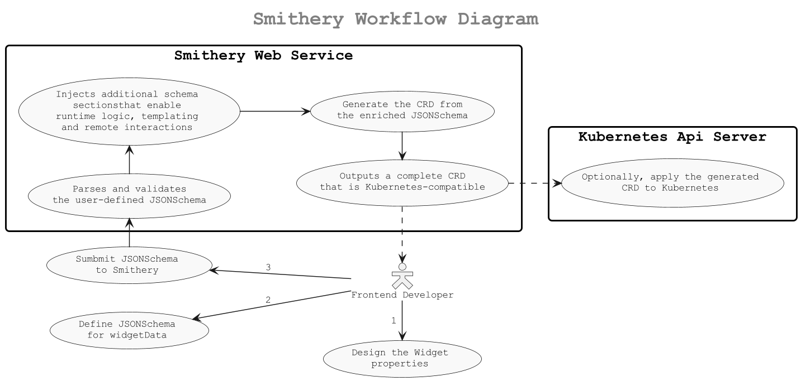

# Smithery

This service transforms a user-defined `JSONSchema` into a Kubernetes [**Custom Resource Definition (CRD)**](https://kubernetes.io/docs/tasks/extend-kubernetes/custom-resources/custom-resource-definitions/) that defines the structure and behavior of UI components. 

It's designed for front-end developers to describe component configuration declaratively, while enabling runtime enrichment and action handling via a companion service called [**Snowplow**](https://github.com/krateoplatformops/snowplow).

---

## Purpose

Front-end developers use `Smithery` to define the properties of a UI component using [`JSONSchema`](https://json-schema.org/), specifically under the `widgetData` section. 

Smithery:

1. Parses and validates the user-defined schema.
2. Injects additional schema sections that enable runtime logic, templating, and remote interactions.
3. Outputs a complete CRD that is Kubernetes-compatible.

---

## Workflow Overview

---

## Injected Schema Sections

Before generating the CRD, Smithery automatically injects the following three JSONSchema sections into the root level of the user’s schema. These allow CRs to be dynamically enriched and to interact with external systems at runtime.

| Field                | Type   | Description                                                                                                                                |
| -------------------- | ------ | ------------------------------------------------------------------------------------------------------------------------------------------ |
| `apiRef`             | object | Defines a [**RESTAction**](https://github.com/krateoplatformops/snowplow/blob/main/RESTAction.md) that acts as a data source. The response (JSON) will be available for JQ expression resolution in templates.           |
| `widgetDataTemplate` | object | A **template layer** on top of `widgetData` using **JQ expressions**. These are evaluated at runtime by Snowplow, with data from `apiRef`. |
| `resourcesRefs`      | object | Describes a set of **runtime actions** (e.g., REST operations) triggered by the component (e.g., onClick for a button).                    |
| `resourcesRefsTemplate`  | object | Describes one or more templates to generate set of **runtime actions** (e.g., REST operations) triggered by the component (e.g., onClick for a button).                    |

> These sections are located in the Smithery repo under [`/assets`](https://github.com/krateoplatformops/smithery/tree/main/internal/handlers/util/jsonschema/assets).

---

### `apiRef` – External Data Source

* Located at: [`apiRef.json`](https://github.com/krateoplatformops/smithery/blob/main/internal/handlers/util/jsonschema/assets/apiRef.json)
* Defines a single REST request (method, URL, headers, body) with optional parameters.
* [Snowplow](https://github.com/krateoplatformops/snowplow) executes this and stores the result as a JSON object, accessible to templates and logic elsewhere in the CR.

**Example Use Case:**

Fetching a list of users from an external API to populate a dropdown.

---

### `widgetDataTemplate` – JQ-based Field Templating

* Located at: [`widgetDataTemplate.json`](https://github.com/krateoplatformops/smithery/blob/main/internal/handlers/util/jsonschema/assets/widgetDataTemplate.json)

* Defines an array of pairs of _path_ to `widgetData` properties and a related _JQ expression_.
* At runtime, [Snowplow](https://github.com/krateoplatformops/snowplow) evaluates these using the `apiRef` result as input and merges the evaluated data into `widgetData` specs.

**Example Use Case:**

Filling a widget fields with data from an external remote HTTP service (or internal Kubernetes API call).

---

### `resourcesRefs` – Declarative Actions

* Located at: [`resourcesRefs.json`](https://github.com/krateoplatformops/smithery/blob/main/internal/handlers/util/jsonschema/assets/resourcesRefs.json)
* Defines runtime **actions** triggered by the widget, such as HTTP POST requests when a button is clicked.
* These can be tied to UI events and can have different HTTP methods, payloads, etc.

**Example Use Case:**

When a button is clicked, send a `POST` request to submit form data to an external API (or to Kubernetes API Server).

---

### `resourcesRefsTemplate` – Declarative Actions Templates

* Located at: [`resourcesRefs.json`](https://github.com/krateoplatformops/smithery/blob/main/internal/handlers/util/jsonschema/assets/resourcesRefsTemplate.json)

* Allows for the definition of one or more templates to dynamically generate `resourcesRefs` objects. In this context, "dynamically" means that the properties (i.e., their values) are the results of JQ expressions evaluated against the output obtained from a previous resolution of an `apiRef`.

This mechanism enables the flexible and automated creation of resource references based on dynamic data, facilitating more adaptable and efficient workflows.

---

## Resources

* [Smithery GitHub Repository](https://github.com/krateoplatformops/smithery)
* [Injected Schema Definitions](https://github.com/krateoplatformops/smithery/tree/main/internal/handlers/util/jsonschema/assets)
* [Kubernetes CRD Docs](https://kubernetes.io/docs/tasks/extend-kubernetes/custom-resources/custom-resource-definitions/)
* [JQ Language](https://stedolan.github.io/jq/)

